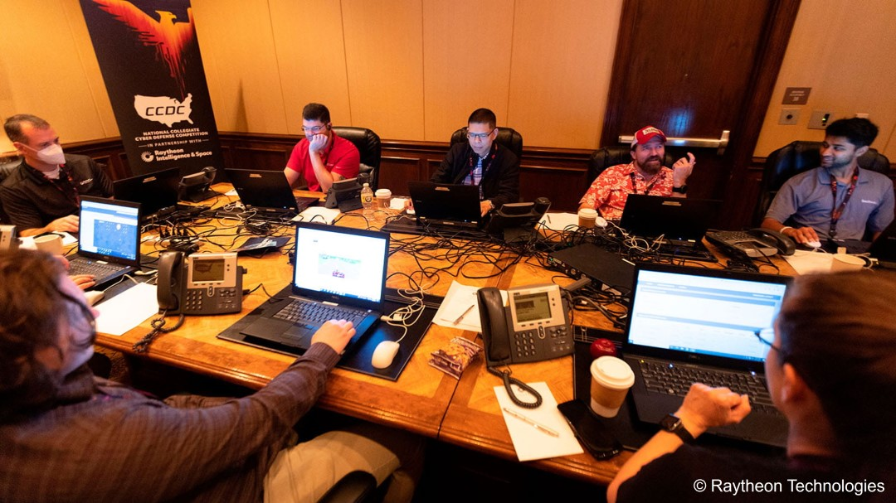

# [atet](https://github.com/atet) / [**_profile_ignited_**](https://github.com/atet/profile_ignited/blob/main/README.md#atet--profile_ignited)

# [Athit Kao, PhD](https://www.athitkao.com)

My profile for the Ignited Education Cybersecurity Curriculum for middle and high school students.

--------------------------------------------------------------------------------------------------

> 
> Volunteering with my colleagues at the National Collegiate Cyber Defense Competition. (Photo Credit: [Raytheon Technologies](https://www.raytheonintelligenceandspace.com/news/2022/05/12/university-of-central-florida-win-back-to-back-championships))

--------------------------------------------------------------------------------------------------

***What do you like to do outside of work?***

I enjoy flexing my amateur travel agent skills to coordinate trips with family and friends to see unique places and eat interesting foods. My top experiences have been visiting [_Foamhenge_](https://en.wikipedia.org/wiki/Foamhenge), an exact replica of Stonehenge made from foam in Natural Bridge, Virginia and almost winning a [_durian_](https://en.wikipedia.org/wiki/Durian#Flavour_and_odour) eating contest.

—

***What is your current job title?***

I am a Senior Principal Engineer with Honors at Raytheon Blackbird Technologies, a specialized subsidiary of [_Raytheon Technologies_](https://www.rtx.com/news/2022/07/01/raytheon-100-anniversary), the world's largest aerospace and defense company.

—

***What do you do in this position?***

My mission at Raytheon is making artificial intelligence and machine learning (AI/ML) technology accessible to those from other domains. Along with helping internal and external collaborators with AI/ML innovation, I also fulfill other positions ranging from individual contributor to leadership roles across various customers.

—

***What might young people find interesting about your work and how might it connect with their lives?***

The first time I watched [_Bill Nye the Science Guy_](https://en.wikipedia.org/wiki/Bill_Nye_the_Science_Guy) in third grade, I just knew I had to be a Scientist. After becoming one, I saw that other industries needed to leverage the power of the scientific method and have advocated like Bill Nye since. Looking back, I guess I just wanted to be Bill Nye when I grew up!

—

***Can you talk about your career path?***

In high school, I worked at a bakery and handled everything from packing bread to working the cash register. That experience sparked my love for cooking; teaching me the discipline and patience necessary to follow the complex “recipes” of science projects I would have in my later years. In early college, I was a Sales Associate at CarMax, the largest automotive retailer in the world at the time. Collaborating with my customers to find their perfect vehicles, I rapidly developed a solid foundation of intrapersonal skills critical for me to become a better team member and leader in my professional career. 

I started my path as a Scientist in my later undergraduate years when my biology professor asked me to join her research lab. I had no idea agreeing would have put me on a non-stop rollercoaster of new experiences ranging from using futuristic technologies to challenging my public speaking confidence. What seemed like an ordinary decision led to increasingly more opportunities after I graduated: securing an internship, starting my first Scientist position, moving cross country for graduate school, publishing my first peer-reviewed article, pivoting my career to computer science, earning my PhD, and receiving my first patent.

When the biotechnology sector had a recession in the mid-2010s and the successful startup I was working at lost investor support, I decided to pursue a different childhood dream and pivoted to the video gaming industry. Banding my colleagues together to bring our novel ideas to market, we competitively won incubator funding and training to become bonafide entrepreneurs. As I continued to develop my business skills starting a company, I was recruited to lead an AI/ML initiative at Raytheon Technologies and pivoted yet again to become an Engineer. Three years later, I attribute the close relationships I’ve built with my leadership team, colleagues, mentors, and mentees for the amazing opportunities I have to positively benefit our world.

[Back to Top](#table-of-contents)

--------------------------------------------------------------------------------------------------

Copyright © 2023-∞ Athit Kao, <a href="http://www.athitkao.com/tos.html" target="_blank">Terms and Conditions</a>

